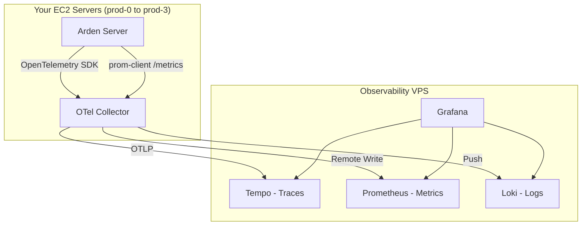
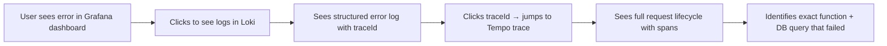
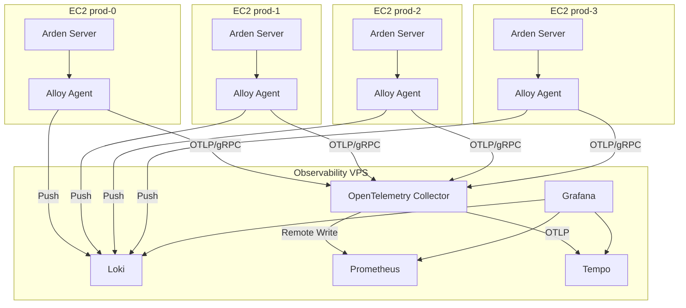

# Observability Report for Arden-Server

## Project Investigation Summary

| Aspect                     | Details                                                                                        |
| -------------------------- | ---------------------------------------------------------------------------------------------- |
| **Runtime**                | Node.js + TypeScript (Express 4.x)                                                             |
| **Database**               | MySQL via Prisma ORM                                                                           |
| **Process Manager**        | PM2 (single process per server)                                                                |
| **Reverse Proxy**          | Nginx (upstream load balancer)                                                                 |
| **Production Servers**     | 4 EC2 instances (prod-0 through prod-3)                                                        |
| **Deployment**             | Rolling deploy via GitHub Actions + SSH                                                        |
| **Existing Observability** | Sentry (errors only, tracing disabled), PostHog (prisma exceptions), Morgan (dev console logs) |
| **Route Count**            | ~250+ routes across 7 app modules                                                              |
| **Cron Jobs**              | ~20 scheduled tasks                                                                            |
| **Traffic**                | ~10M requests/month (~3.8 RPS average)                                                         |

---

## The Grafana Stack (LGTM)

The industry-standard self-hosted observability stack from Grafana Labs:

| Component      | Role                       | What It Replaces                    |
| -------------- | -------------------------- | ----------------------------------- |
| **Grafana**    | Visualization & dashboards | Your Sentry dashboard views         |
| **Prometheus** | Metrics storage & querying | express-status-monitor              |
| **Loki**       | Log aggregation & search   | Console logs / PM2 logs             |
| **Tempo**      | Distributed tracing        | Sentry tracing (currently disabled) |



---

## Part 1: Metrics (Prometheus + Grafana)

### What Metrics to Track

#### 1. RED Metrics (Rate, Errors, Duration) — per route

| Metric                          | Type      | Description                                                 |
| ------------------------------- | --------- | ----------------------------------------------------------- |
| `http_requests_total`           | Counter   | Total requests, labeled by `method`, `route`, `status_code` |
| `http_request_duration_seconds` | Histogram | Latency distribution (gives you p50, p70, p90, p95, p99)    |
| `http_request_errors_total`     | Counter   | Requests returning 4xx/5xx                                  |

#### 2. USE Metrics (Utilization, Saturation, Errors) — system-level

| Metric                          | Type      | Description                           |
| ------------------------------- | --------- | ------------------------------------- |
| `nodejs_eventloop_lag_seconds`  | Gauge     | Event loop lag (critical for Node.js) |
| `nodejs_active_handles_total`   | Gauge     | Active handles (sockets, timers)      |
| `nodejs_active_requests_total`  | Gauge     | Active libuv requests                 |
| `nodejs_heap_size_used_bytes`   | Gauge     | V8 heap memory usage                  |
| `nodejs_gc_duration_seconds`    | Histogram | Garbage collection pause times        |
| `process_cpu_seconds_total`     | Counter   | CPU time consumed                     |
| `process_resident_memory_bytes` | Gauge     | RSS memory                            |

#### 3. Business Metrics (specific to your app)

| Metric                                     | Description                                     |
| ------------------------------------------ | ----------------------------------------------- |
| `prisma_query_duration_seconds`            | DB query latency by model/operation             |
| `cron_job_duration_seconds`                | Duration of each cron job execution             |
| `cron_job_errors_total`                    | Failed cron executions                          |
| `active_websocket_connections`             | Current WebSocket connection count              |
| `payment_gateway_request_duration_seconds` | Cashfree API call latency                       |
| `external_api_request_duration_seconds`    | Third-party API latency (SendGrid, MSG91, etc.) |

### How It Works

**Library:** `prom-client` (de facto standard for Node.js Prometheus metrics)

The approach is to create an Express middleware that wraps every request and records the three RED metrics. Your `makeExpressCallback` port adapter in [makeExpressCallback.ts](file:///Users/niharhegde/Developer/Warden/arden-server/src/ports/makeExpressCallback.ts) is the ideal single point to instrument — every route flows through it.

**Key concept — Histogram buckets:** Prometheus histograms divide latency into buckets. For a backend like yours, good defaults are:

```
[0.005, 0.01, 0.025, 0.05, 0.1, 0.25, 0.5, 1, 2.5, 5, 10]
```

This lets you compute any percentile (p50, p70, p95, p99) at query time using PromQL:

```
histogram_quantile(0.95, rate(http_request_duration_seconds_bucket[5m]))
```

**Exposing metrics:** You add a `/metrics` endpoint to Express that Prometheus scrapes every 15s. At ~3.8 RPS, this generates negligible overhead.

### Production-Grade Dashboards You'd Build

1. **API Overview** — Total RPS, error rate %, p95 latency, top 10 slowest routes
2. **Route Deep-Dive** — Per-route breakdown, filterable by app module (admin-app, booking-app, etc.)
3. **Node.js Health** — Event loop lag, heap usage, GC pauses, CPU
4. **Database** — Query duration by model, slow query count, connection pool usage
5. **Cron Jobs** — Execution time, success/failure rate, last run timestamp
6. **External Services** — Cashfree, SendGrid, S3, WhatsApp gateway latencies

### Alerting Rules (industry standard)

| Alert           | Condition                            | Severity |
| --------------- | ------------------------------------ | -------- |
| High Error Rate | 5xx rate > 5% for 5 min              | Critical |
| High Latency    | p95 > 3s for 5 min                   | Warning  |
| Event Loop Lag  | > 500ms for 2 min                    | Critical |
| Memory Leak     | Heap growing continuously for 30 min | Warning  |
| Cron Failure    | Any cron fails 3x consecutively      | Critical |
| DB Slow Queries | p95 query time > 2s for 5 min        | Warning  |

---

## Part 2: Distributed Tracing (Tempo + OpenTelemetry)

### What Tracing Gives You

A **trace** follows a single request through your entire system. Each step becomes a **span**:

```
[HTTP Request: POST /api/v1/admin-app/create-resident]
  ├── [Middleware: auth] 12ms
  ├── [Middleware: checkPermission] 3ms
  ├── [Controller: makeExpressCallback] 1ms
  │   ├── [UseCase: createResident] 245ms
  │   │   ├── [DB: prisma.resident.create] 89ms
  │   │   ├── [DB: prisma.permission.create] 45ms
  │   │   ├── [External: SendGrid.sendEmail] 320ms ← SLOW!
  │   │   └── [External: WhatsApp.sendMessage] 180ms
  │   └── [Response: 201] 2ms
  └── Total: 897ms
```

When an error occurs, the trace shows you **exactly** where it happened and what led up to it.

### What to Trace (your requirements mapped)

| Scenario                   | What You See in the Trace                                               |
| -------------------------- | ----------------------------------------------------------------------- |
| Error debugging            | Full span tree showing which function threw, input data, stack trace    |
| Slow request investigation | Which span took the longest — DB query? External API? Business logic?   |
| Payment failures           | Cashfree API call details, request/response payloads, retry attempts    |
| Cron job issues            | Which step in the cron failed, DB queries it ran, notifications it sent |

### How It Works

**Library:** `@opentelemetry/sdk-node` + auto-instrumentation libraries

OpenTelemetry (OTel) is the CNCF standard. You install the SDK and auto-instrumentation packages that automatically create spans for:

- HTTP requests (incoming + outgoing)
- Prisma/MySQL queries
- Express middleware chains

For your specific needs, you'd add **manual spans** in:

- [makeExpressCallback.ts](file:///Users/niharhegde/Developer/Warden/arden-server/src/ports/makeExpressCallback.ts) — wrap the controller call
- Use-case functions — wrap business logic
- Gateway calls — wrap external API calls (Cashfree, SendGrid, etc.)

### Smart Sampling Strategy (for 10M req/month)

You don't want to trace every request. Industry standard:

| Rule                   | Sample Rate | Rationale                                         |
| ---------------------- | ----------- | ------------------------------------------------- |
| Errors (4xx, 5xx)      | **100%**    | Always trace errors — this is your #1 requirement |
| Slow requests (> 2s)   | **100%**    | Always trace slow requests                        |
| Payment/Booking routes | **20%**     | Business-critical, trace more                     |
| Health checks / static | **0%**      | Never trace noise                                 |
| Everything else        | **5%**      | Baseline visibility                               |

This gives you ~500K-1M traces/month instead of 10M, keeping storage manageable.

### Error Tracing Detail

When an error is caught in your `makeExpressCallback.catch()`, the trace span gets:

- `status: ERROR`
- `error.type`: The error class (PrismaClientKnownRequestError, your custom Error, etc.)
- `error.message`: The error message
- `error.stack`: Full stack trace
- Custom attributes: `userId`, `permissionId`, `companyId`, `action`, request body

This means in Grafana you can search: _"Show me all error traces for `/admin-app/get-transactions` in the last 24 hours"_ and see exactly what happened in each one.

---

## Part 3: Logging (Loki + Pino)

### Current State vs. Target State

| Current                                   | Target                                        |
| ----------------------------------------- | --------------------------------------------- |
| `console.log` / `console.warn` everywhere | Structured JSON logs via Pino                 |
| Morgan `'dev'` format (human-readable)    | Structured access logs with trace correlation |
| Logs go to PM2 stdout only                | Logs shipped to Loki, searchable in Grafana   |
| No log levels, no filtering               | Proper levels: error, warn, info, debug       |

### What to Log (your requirements)

#### Always Log (errors)

- All 5xx responses — full error details, stack trace, request context
- All Prisma errors — query that failed, model, operation
- All external API failures — Cashfree, SendGrid, WhatsApp, S3
- Cron job failures — which job, what went wrong
- Authentication failures — invalid tokens, permission denials
- Unhandled exceptions and promise rejections

#### Selectively Log (success)

- Payment completions — `mark-rent-payment-paid`, `mark-invoice-paid`
- Booking state changes — `upsert-booking`, `cancel-booking`, `close-booking`
- Resident lifecycle — `create-resident`, `mark-resident-moved-out`
- Contract signing — `sign-contract`
- Any write operation that mutates critical business data

#### Never Log

- GET requests for listings/reads (too noisy at your volume)
- Health checks
- Static file serving
- Request/response bodies containing sensitive data (passwords, tokens, PII)

### Why Pino (not Winston)

| Feature           | Pino                                   | Winston              |
| ----------------- | -------------------------------------- | -------------------- |
| Performance       | ~5x faster (critical at 10M req/month) | Slower, blocking I/O |
| Output            | Native JSON (what Loki wants)          | Needs formatting     |
| Overhead          | ~3% CPU                                | ~8-12% CPU           |
| Industry adoption | Used by Fastify, NestJS defaults       | Legacy standard      |

### Structured Log Format

Every log entry becomes a JSON object:

```json
{
  "level": "error",
  "timestamp": "2026-04-19T12:30:00.000Z",
  "traceId": "abc123def456",
  "spanId": "789ghi",
  "service": "arden-server",
  "serverId": "prod-2",
  "action": "create-resident",
  "module": "admin-app",
  "userId": 42,
  "companyId": 5,
  "method": "POST",
  "path": "/api/v1/admin-app/create-resident",
  "statusCode": 500,
  "duration": 1234,
  "error": {
    "name": "PrismaClientKnownRequestError",
    "message": "Unique constraint failed on the fields: (`phone`)",
    "code": "P2002",
    "stack": "..."
  }
}
```

The `traceId` field is the magic — it links this log to its trace in Tempo. In Grafana, you click a log entry and jump directly to the full trace.

### Log Correlation Flow



---

## Part 4: Infrastructure Setup (Self-Hosted VPS)

### Recommended VPS Specs

For 10M requests/month:

| Component      | CPU         | RAM      | Storage        | Notes                            |
| -------------- | ----------- | -------- | -------------- | -------------------------------- |
| Grafana        | 1 core      | 1 GB     | 10 GB          | Lightweight UI server            |
| Prometheus     | 2 cores     | 4 GB     | 50 GB SSD      | 15-day retention default         |
| Loki           | 2 cores     | 2 GB     | 100 GB SSD     | Log storage grows fast           |
| Tempo          | 1 core      | 2 GB     | 50 GB SSD      | With sampling, very manageable   |
| OTel Collector | 1 core      | 512 MB   | —              | Stateless relay                  |
| **Total VPS**  | **4 cores** | **8 GB** | **200 GB SSD** | ~$40-60/month on Hetzner/Contabo |

### Architecture



**Grafana Alloy** (formerly Grafana Agent) runs on each EC2 instance. It:

1. Scrapes `/metrics` from your app → forwards to Prometheus
2. Tails PM2/stdout logs → pushes to Loki
3. Receives OTLP traces from OTel SDK → forwards to Tempo

### Docker Compose for the Observability VPS

The entire stack runs as Docker containers orchestrated by a single `docker-compose.yml`:

| Service          | Image                                  | Ports                              |
| ---------------- | -------------------------------------- | ---------------------------------- |
| `grafana`        | `grafana/grafana:latest`               | 3000 (UI)                          |
| `prometheus`     | `prom/prometheus:latest`               | 9090                               |
| `loki`           | `grafana/loki:latest`                  | 3100                               |
| `tempo`          | `grafana/tempo:latest`                 | 4317 (OTLP gRPC), 4318 (OTLP HTTP) |
| `otel-collector` | `otel/opentelemetry-collector-contrib` | 4317                               |

### Data Retention & Storage Estimates

| Signal           | Daily Volume    | 15-day Retention | 30-day Retention |
| ---------------- | --------------- | ---------------- | ---------------- |
| Metrics          | ~50 MB          | ~750 MB          | ~1.5 GB          |
| Logs (selective) | ~200 MB         | ~3 GB            | ~6 GB            |
| Traces (sampled) | ~500 MB         | ~7.5 GB          | ~15 GB           |
| **Total**        | **~750 MB/day** | **~11 GB**       | **~22 GB**       |

---

## Part 5: Step-by-Step Implementation Plan

### Phase 1: Infrastructure (Day 1-2)

1. Provision a VPS (4 cores, 8 GB RAM, 200 GB SSD)
2. Install Docker + Docker Compose
3. Deploy Grafana + Prometheus + Loki + Tempo via docker-compose
4. Configure Nginx reverse proxy with SSL (Let's Encrypt) for Grafana UI
5. Set up basic auth on Grafana
6. Verify all services are healthy

### Phase 2: Metrics (Day 3-5)

1. Install `prom-client` in arden-server
2. Create a metrics middleware that instruments RED metrics
3. Add the middleware to `app.ts` before routes
4. Expose `/metrics` endpoint
5. Install Grafana Alloy on all 4 EC2 instances
6. Configure Alloy to scrape `/metrics` and remote-write to Prometheus
7. Build the API Overview dashboard in Grafana
8. Build the Node.js Health dashboard
9. Set up critical alerting rules

### Phase 3: Logging (Day 6-8)

1. Install `pino` + `pino-http`
2. Create a logger factory that produces structured JSON logs
3. Replace `morgan('dev')` with `pino-http` middleware (selective logging)
4. Replace `console.log/warn` calls in `makeExpressCallback.ts` catch blocks with structured pino calls
5. Add logging to critical business operations (payments, bookings, contracts)
6. Configure Alloy to tail PM2 logs and push to Loki
7. Build log exploration dashboard in Grafana
8. Set up log-based alerts (error rate spikes)

### Phase 4: Tracing (Day 9-12)

1. Install OpenTelemetry SDK + auto-instrumentation packages:
   - `@opentelemetry/sdk-node`
   - `@opentelemetry/auto-instrumentations-node`
   - `@opentelemetry/exporter-trace-otlp-grpc`
2. Create `src/telemetry.ts` (must load before everything else, similar to your `sentryInstrument.ts`)
3. Configure tail-based sampling in OTel Collector
4. Add manual spans to `makeExpressCallback.ts`
5. Add trace context to Pino logs (traceId correlation)
6. Build trace exploration dashboard in Grafana
7. Configure Tempo → Loki and Loki → Tempo cross-linking in Grafana data sources

### Phase 5: Polish (Day 13-15)

1. Add Prisma query metrics (middleware on PrismaClient)
2. Add cron job instrumentation
3. Add external service call metrics (Cashfree, SendGrid, etc.)
4. Build business-specific dashboards
5. Load test and verify overhead is < 5% CPU
6. Document runbooks for common alert scenarios
7. Gradually reduce Sentry dependency (keep for crash reporting initially)

---

## Part 6: Additional Recommendations

### Things You Didn't Mention But Should Have

1. **Uptime monitoring** — Use Grafana Synthetic Monitoring or a simple external ping (UptimeRobot) to monitor your endpoints from outside your network.

2. **Database observability** — Export MySQL metrics via `mysqld_exporter` to Prometheus. Track: query throughput, slow queries, connection pool, replication lag.

3. **Nginx metrics** — Enable `nginx_exporter` on prod-0 to track: upstream response times per backend, 502/504 rates, connection counts, request queue depth.

4. **SLOs (Service Level Objectives)** — Define targets like:
   - 99.9% of requests complete in < 3s
   - Error rate < 0.5%
   - Uptime > 99.9%
     Grafana has built-in SLO tracking.

5. **On-call alerting** — Connect Grafana Alerting to PagerDuty, Slack, or Telegram for critical alerts.

6. **Profiling** — Grafana Pyroscope for continuous profiling. Useful when you have CPU-intensive operations (your analytics/statistics endpoints, PDF generation).

### Sentry Migration Path

| Capability     | Current (Sentry)        | Target (Grafana Stack)              | When to Migrate |
| -------------- | ----------------------- | ----------------------------------- | --------------- |
| Error tracking | ✅ Active               | Loki + structured error logs        | Phase 3         |
| Tracing        | ❌ Disabled (0% sample) | Tempo + OTel                        | Phase 4         |
| Profiling      | ❌ Disabled (0% sample) | Pyroscope (optional)                | Phase 5+        |
| Metrics        | ❌ Not used             | Prometheus                          | Phase 2         |
| Source maps    | ✅ Uploaded             | Not needed (logs have stack traces) | Phase 3         |

You can keep Sentry running alongside initially and decommission it once you're confident in the Grafana stack.

### NPM Packages You'll Need

```
# Metrics
prom-client

# Logging
pino
pino-http

# Tracing (OpenTelemetry)
@opentelemetry/sdk-node
@opentelemetry/api
@opentelemetry/auto-instrumentations-node
@opentelemetry/exporter-trace-otlp-grpc
@opentelemetry/exporter-metrics-otlp-grpc
@opentelemetry/resources
@opentelemetry/semantic-conventions

# Prisma instrumentation
@prisma/instrumentation
```

### Cost Comparison

| Solution                        | Monthly Cost | Notes                          |
| ------------------------------- | ------------ | ------------------------------ |
| **Self-hosted Grafana stack**   | **$40-60**   | VPS cost only, unlimited data  |
| Datadog (10M requests)          | $400-800     | Per-host + log volume pricing  |
| New Relic (10M requests)        | $200-500     | Per-GB ingestion               |
| Sentry (current, full features) | $80-150      | Limited to errors + tracing    |
| Grafana Cloud (free tier)       | $0-50        | 50 GB logs, 10K metrics series |

> [!TIP]
> Self-hosting is ~10x cheaper than SaaS alternatives at your scale. The tradeoff is you maintain the infrastructure, but with Docker Compose it's very manageable.

---

## Key Integration Points in Your Codebase

| File                               | What Changes                                      | Why                                                     |
| ---------------------------------- | ------------------------------------------------- | ------------------------------------------------------- |
| `src/telemetry.ts`                 | **[NEW]** OTel SDK initialization                 | Must load before everything, like `sentryInstrument.ts` |
| `src/server.ts`                    | Import telemetry first                            | OTel must init before Express                           |
| `src/app.ts`                       | Add pino-http middleware, add `/metrics` endpoint | Central middleware registration                         |
| `src/ports/makeExpressCallback.ts` | Add structured error logging, manual trace spans  | Single point for all request handling                   |
| `src/gateways/logger/logger.ts`    | Replace with Pino-based structured logger         | Current logger only sends to Sentry                     |
| `src/crons/index.ts`               | Wrap each cron with metrics + tracing             | Track cron health                                       |
| `src/database/db.server.ts`        | Add Prisma instrumentation middleware             | Track query performance                                 |
